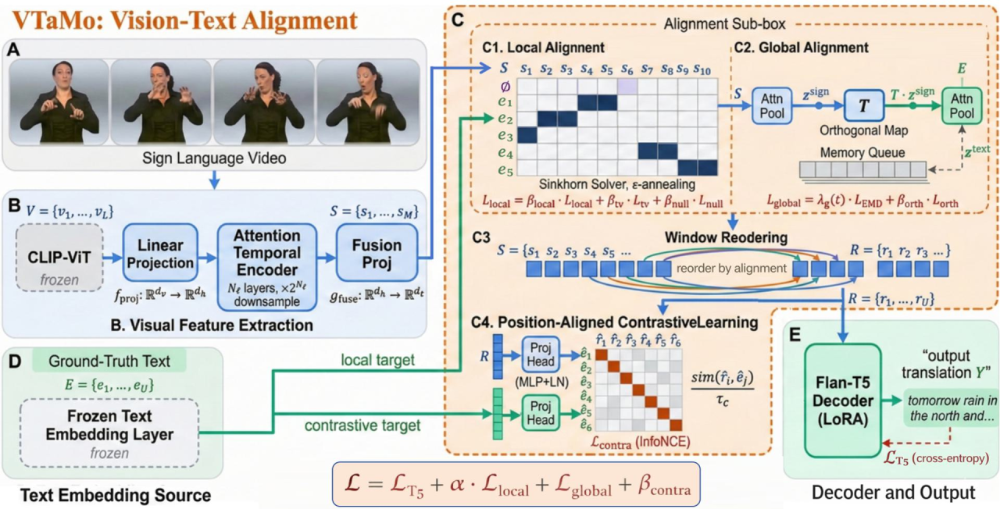

# VTaMo: Video–Text Alignment Model for Sign Language Translation

> Official repository for **VTaMo**, a gloss-free sign language translation framework built on **explicit multi-granularity vision–text alignment**.

<p align="center">
  <a href="https://arxiv.org/abs/2607.09126"></a>
  <a href="#-todo--release-plan"></a>
  
  
  <a href="LICENSE"></a>
</p>

**Junyi Hu**<sup>1</sup>, **Zhewen He**<sup>1</sup>, **Haomian Huang**<sup>1</sup>, **Aoxiang Yang**<sup>1</sup>, **Yi Fang**<sup>1,2,†</sup>

<sup>1</sup> New York University Abu Dhabi &nbsp;&nbsp; <sup>2</sup> ChatSign Technology &nbsp;&nbsp; <sup>†</sup> Corresponding author

---

## Overview

Sign language translation (SLT) converts continuous sign videos into spoken-language text. Gloss-free approaches leverage pre-trained visual encoders and language models, but rely on **implicit** cross-modal alignment learned inside the decoder from translation supervision alone. This is fragile because sign languages often do not follow the word order of the corresponding spoken language, so visual features along the video timeline are frequently misaligned with the text tokens an autoregressive decoder is trained to predict.

**VTaMo** makes alignment **explicit**. Instead of asking the decoder to simultaneously learn translation *and* silently discover a latent cross-modal permutation, VTaMo learns the correspondence between visual segments and text tokens directly, and presents the decoder with a semantically ordered visual sequence. Because many spoken words (articles, prepositions, auxiliaries) have no sign-level counterpart, VTaMo aligns against and decodes a content-word **pseudo-gloss** of the target rather than the raw sentence, and restores fluent sentences afterwards with a lightweight, text-only recovery model.

<p align="center"><i>Explicit alignment sharpens frame-to-token correspondences, simplifies decoder learning, and improves robustness — especially on large-vocabulary benchmarks.</i></p>

## Method

<p align="center">
  
</p>
<p align="center"><i>The VTaMo pipeline. A sign video is encoded by a frozen CLIP-ViT backbone with a lightweight temporal encoder and fusion projection (A, B). Given text embeddings (D), VTaMo performs <b>local alignment</b> with an entropy-regularized OT (Sinkhorn) solver and <b>global alignment</b> via an orthogonal transform with a memory queue (C1, C2). The correspondence drives <b>window reordering</b> (C3) and <b>position-aligned contrastive learning</b> (C4), and a LoRA-adapted Flan-T5 decoder generates the translation (E).</i></p>

VTaMo introduces alignment at **three complementary granularities**, trained jointly with the standard translation objective:

- **① Local alignment — entropy-regularized Optimal Transport.**
  A Sinkhorn solver estimates a soft, fine-grained correspondence between temporal visual segments and pseudo-gloss tokens, using cosine similarity as the transport cost. A single **learnable null token** absorbs transitional gestures and co-articulation frames that correspond to no explicit word, so the model is never forced to map every frame onto a content token. A multi-phase ε-annealing schedule, a temporal-variation term, and a null-cost regularizer keep the learned plan sharp, temporally coherent, and stable.

- **② Global alignment — learnable orthogonal transformation.**
  Because the visual and textual encoders are pre-trained on different modalities, paired sentence embeddings can suffer an orientation mismatch even when semantically equivalent. VTaMo applies a **learnable orthogonal transform** (a rotation that preserves norms and angles) to the pooled visual sentence embedding and calibrates the two spaces through an Earth Mover's Distance objective, computed over a FIFO **memory queue** that diversifies the sentence pairs.

- **③ Position-aligned contrastive learning.**
  Using the transport plan, visual features are **reordered** into target-token order during training and bound to their text-token embeddings via an InfoNCE objective. This gives each visual token discriminative, token-level grounding without altering the frozen language-model embedding space.

**Reordering & inference.** During training, a window-based reordering step places the visual features in target-token order so the decoder's cross-entropy gradient reinforces (rather than fights) the alignment objectives. At inference the target order is unknown, so **no reordering is applied**: the decoder reads visual tokens in signing order and emits a pseudo-gloss; a **text-only recovery model** — trained purely by shuffling content words of plain sentences and learning to reconstruct them — restores spoken word order and re-inserts the dropped function words.

**Architecture.** A frozen **CLIP-ViT-Large** backbone (with multi-scale S²-Wrapper features) encodes frames; an attention-based temporal encoder downsamples them; a fusion projector maps to the language-model space; and a **LoRA-adapted Flan-T5-XL** decoder generates the pseudo-gloss. Only lightweight adapters and alignment modules are trained — the visual and language backbones stay frozen.

## Getting Started

> **Scope of this release.** This drop contains the **data-preparation and training**
> code only. Inference/evaluation scripts and pre-trained VTaMo weights are not
> included yet — see the release plan below. The frozen backbones (CLIP-ViT-L/14,
> Flan-T5-XL) are downloaded from HuggingFace on first run.

### Repository layout

```
.
├── pseudo_gloss/           Step 1 — English sentence → content-word pseudo-gloss.
│                           The paper's pseudo-gloss is a frozen spaCy POS filter
│                           keeping NOUN/VERB/ADJ/ADV/NUM/PRON/PROPN (the default).
│                           A ChatSign phrase-merge/reorder extension also ships,
│                           clearly marked as NOT the paper's method.
├── scripts/
│   ├── preprocess/         Step 2 — build How2Sign / OpenASL annotations; bridge
│   │                       the pseudo-gloss into the annotation format
│   └── extract_features/   Step 3 — frozen CLIP-ViT-L/14 frame features (S²-Wrapper)
├── configs/                Step 4 — training configs (OmegaConf)
│   ├── vtamo_how2sign.yaml
│   └── vtamo_openasl.yaml
├── main.py                 training entry point
├── run_train.sh            training launcher
├── vtamo/
│   ├── model.py            VTaMo model (Flan-T5 + LoRA, joint alignment objectives)
│   ├── ot_sinkhorn.py      ① local alignment: Sinkhorn OT, learnable null token,
│   │                          window reordering, position-aligned contrastive loss;
│   │                          also hosts the learnable orthogonal transform T
│   ├── global_align.py     ② global alignment: orthogonal T, EMD over a FIFO memory
│   │                          queue, Procrustes init, λ_g and ε schedules
│   ├── tconv.py            attention-based temporal encoder
│   └── mm_projector.py     fusion projector
├── dataset/                dataset loaders + Lightning DataModule
└── utils/                  S²-Wrapper, BLEU/ROUGE evaluation, helpers
```

Hyperparameters in `configs/vtamo_how2sign.yaml` are annotated with the paper section
they come from, so the config can be checked line-by-line against the text. The handful
of operational values the paper does not state (`t_warm`, `max_epochs`, validation
interval) are explicitly marked as such rather than presented as paper values.

### Installation

```bash
conda create -n vtamo python=3.10 && conda activate vtamo
pip install -r requirements.txt
```

Pseudo-gloss extraction needs spaCy, which is kept out of the pinned training
env to avoid dependency conflicts:

```bash
pip install spacy==3.8.14 && python -m spacy download en_core_web_sm
```

### Data layout

Datasets and extracted features are **linked, never committed**. The configs
expect the following under `./assets/` (override the roots in the yaml if your
data lives elsewhere):

```
assets/
├── how2sign/
│   ├── label/{train,val,test}_info.npy          # annotations (scripts/preprocess)
│   ├── videos/{train,val,test}/<file_id>.mp4
│   └── features/clip-vit-large-patch14_how2sign/
│       └── {train,val,test}/<file_id>_s2wrapping.npy
└── openasl/
    ├── label/openasl-v1.0-{train,val,test}.tsv
    ├── videos/
    └── features/clip-vit-large-patch14_openasl/<file_id>_s2wrapping.npy
```

### Pipeline

```bash
# 1. Pseudo-gloss for the target sentences
python scripts/preprocess/run_external_pseudo_gloss.py \
    --input sentences.txt --output pseudo_gloss.json

# 2. Annotations (How2Sign shown; see scripts/preprocess/ for OpenASL)
python scripts/preprocess/convert_how2sign_annotations.py --help

# 3. Frozen CLIP-ViT-L/14 features (S²-Wrapper, 2048-d per frame)
python scripts/extract_features/extract_clip_from_mp4.py --help

# 4. Train
./run_train.sh my_run 42                                  # How2Sign (default)
CONFIG=configs/vtamo_openasl.yaml ./run_train.sh my_run 42  # OpenASL
```

Checkpoints and logs are written to `./logs/<run_name>/`.

### Benchmark coverage

This release covers How2Sign, OpenASL, and Phoenix-2014T. The alignment and
training hyperparameters are identical across them — only the dataset block
differs.

| Benchmark | Config | spaCy model for the pseudo-gloss | Splits |
|---|---|---|---|
| How2Sign | `configs/vtamo_how2sign.yaml` | `en_core_web_sm` | train / val / test |
| OpenASL | `configs/vtamo_openasl.yaml` | `en_core_web_sm` | train / val / test |
| Phoenix-2014T | `configs/vtamo_p14t.yaml` | `de_core_news_sm` | train / dev / test |

The POS filter is language-universal (it keys off Universal POS tags); only the
tagger changes. Select it with `--spacy_model`:

```bash
python -m spacy download de_core_news_sm
python scripts/preprocess/run_external_pseudo_gloss.py \
    --spacy_model de_core_news_sm --input sentences.txt --output pseudo_gloss.json
```

> **What we verified.** The model instantiates from all three configs, and the
> dataset loaders were exercised against real data where we had it — Phoenix-2014T
> loads its standard 7096 / 519 / 642 train/dev/test splits with 2048-d features.
> We did not run any config to convergence for this release, so treat the dataset
> roots as a starting point and check `spatial_postfix` matches how you extracted
> your features (ours emit `_s2wrapping`).

## 📌 TODO / Release Plan

We are actively cleaning up the codebase and model artifacts for release. Progress will be tracked here:

- [x] **Release training code** — data preparation + end-to-end training pipeline for the alignment objectives and decoder.
- [ ] **Release inference & experiment code** — evaluation scripts, pseudo-gloss recovery, and reproduction of the reported benchmarks.
- [ ] **Release checkpoints** — pre-trained VTaMo weights for the released benchmarks.

⭐ **Star / watch this repo** to be notified when each component lands.

## Citation

If you find VTaMo useful in your research, please consider citing:

```bibtex
@inproceedings{hu2026vtamo,
  title     = {VTaMo: Video-Text Alignment Model for Sign Language Translation},
  author    = {Hu, Junyi and He, Zhewen and Huang, Haomian and Yang, Aoxiang and Fang, Yi},
  booktitle = {European Conference on Computer Vision (ECCV)},
  year      = {2026}
}
```

## License

This project is released under the [Creative Commons Attribution-NonCommercial 4.0 International (CC BY-NC 4.0)](LICENSE) license. You are free to share and adapt the material for **non-commercial** purposes with appropriate attribution. The license may be updated in the future.

## Acknowledgements

The training codebase builds on [**SpaMo**](https://github.com/eddie-euijun-hwang/SpaMo) (Hwang et al., *An Efficient Gloss-Free Sign Language Translation Using Spatial Configurations and Motion Dynamics with LLMs*, NAACL 2025); files derived from it retain their original copyright headers. We also thank the authors of How2Sign, OpenASL, CLIP, Flan-T5, and S²-Wrapper, whose datasets and models this work depends on.

This work was partially supported by ChatSign Technology, Ltd.; and the NYUAD Center for AI and Robotics (CAIR), funded by Tamkeen under the NYUAD Research Institute Award CG010. Computational support was provided by the HPC resources at NYU Abu Dhabi and NYU New York.
